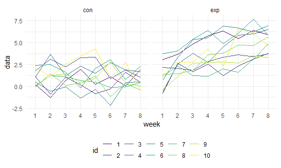
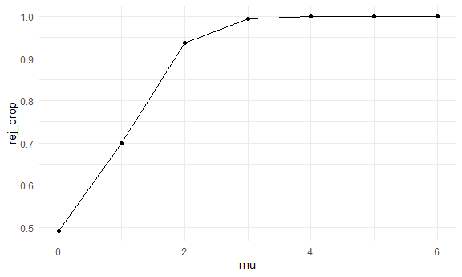
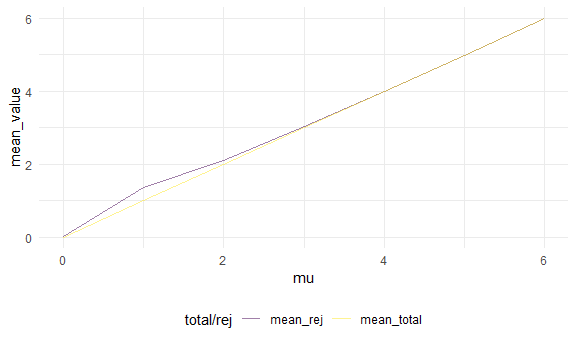

homework5
================
Yu
November 13, 2020

problem 1
---------

``` r
homicide_df = read_csv('data/homicide-data.csv') %>% 
  mutate(city_state = str_c(city, "_", state)) %>% 
  mutate(result = case_when(
    disposition == 'Closed without arrest' ~ 'unsolved',
    disposition == 'Open/No arrest' ~ 'unsolved',
    disposition == 'Closed by arrest' ~ 'solved'
  )) %>% 
  select(city_state, result) %>% 
  filter(city_state != 'Tulsa_AL') %>% 
  group_by(city_state) %>% 
  summarize(
    hom_total = n(),
    hom_unsolved = sum(result == 'unsolved')) 
```

    ## Parsed with column specification:
    ## cols(
    ##   uid = col_character(),
    ##   reported_date = col_double(),
    ##   victim_last = col_character(),
    ##   victim_first = col_character(),
    ##   victim_race = col_character(),
    ##   victim_age = col_character(),
    ##   victim_sex = col_character(),
    ##   city = col_character(),
    ##   state = col_character(),
    ##   lat = col_double(),
    ##   lon = col_double(),
    ##   disposition = col_character()
    ## )

    ## `summarise()` ungrouping output (override with `.groups` argument)

``` r
Baltimore_test = 
  prop.test(
    homicide_df %>%filter(city_state == 'Baltimore_MD') %>% pull(hom_unsolved),
    homicide_df %>%filter(city_state == 'Baltimore_MD') %>% pull(hom_total))%>% 
    broom::tidy()

test_result = 
  homicide_df %>% 
    mutate(prop_test = map2(.y = hom_total, .x = hom_unsolved, ~prop.test(x =.x, n = .y)),
           prop_test = map(prop_test, broom::tidy)) %>% 
  unnest(prop_test)
```

Plot

``` r
test_result %>% 
  mutate(city_state = fct_reorder(city_state, estimate)) %>% 
  ggplot(aes(x = city_state, y = estimate)) + geom_point()+
  geom_errorbar(aes(ymin = conf.low, ymax = conf.high))+
  theme(axis.text.x = element_text(angle = 90, vjust = 0.5, hjust = 1))
```


Problem2
--------

``` r
file = tibble(
  file_name = list.files('data/data/')
) %>% 
  mutate(
    path = str_c('data/data/'，file_name)) %>% 
  mutate(  
    data = map(.x = path, ~read_csv(.x)) 
       ) %>% 
  unnest(data) %>% 
  separate(file_name, into = c('type','id'), sep = c('_')) %>% 
  mutate(id = str_extract(id, '^[0-9][0-9]')) %>% 
  mutate(id = as.numeric(id)) %>% 
  select(-path)
```

    ## Parsed with column specification:
    ## cols(
    ##   week_1 = col_double(),
    ##   week_2 = col_double(),
    ##   week_3 = col_double(),
    ##   week_4 = col_double(),
    ##   week_5 = col_double(),
    ##   week_6 = col_double(),
    ##   week_7 = col_double(),
    ##   week_8 = col_double()
    ## )
    ## Parsed with column specification:
    ## cols(
    ##   week_1 = col_double(),
    ##   week_2 = col_double(),
    ##   week_3 = col_double(),
    ##   week_4 = col_double(),
    ##   week_5 = col_double(),
    ##   week_6 = col_double(),
    ##   week_7 = col_double(),
    ##   week_8 = col_double()
    ## )
    ## Parsed with column specification:
    ## cols(
    ##   week_1 = col_double(),
    ##   week_2 = col_double(),
    ##   week_3 = col_double(),
    ##   week_4 = col_double(),
    ##   week_5 = col_double(),
    ##   week_6 = col_double(),
    ##   week_7 = col_double(),
    ##   week_8 = col_double()
    ## )
    ## Parsed with column specification:
    ## cols(
    ##   week_1 = col_double(),
    ##   week_2 = col_double(),
    ##   week_3 = col_double(),
    ##   week_4 = col_double(),
    ##   week_5 = col_double(),
    ##   week_6 = col_double(),
    ##   week_7 = col_double(),
    ##   week_8 = col_double()
    ## )
    ## Parsed with column specification:
    ## cols(
    ##   week_1 = col_double(),
    ##   week_2 = col_double(),
    ##   week_3 = col_double(),
    ##   week_4 = col_double(),
    ##   week_5 = col_double(),
    ##   week_6 = col_double(),
    ##   week_7 = col_double(),
    ##   week_8 = col_double()
    ## )
    ## Parsed with column specification:
    ## cols(
    ##   week_1 = col_double(),
    ##   week_2 = col_double(),
    ##   week_3 = col_double(),
    ##   week_4 = col_double(),
    ##   week_5 = col_double(),
    ##   week_6 = col_double(),
    ##   week_7 = col_double(),
    ##   week_8 = col_double()
    ## )
    ## Parsed with column specification:
    ## cols(
    ##   week_1 = col_double(),
    ##   week_2 = col_double(),
    ##   week_3 = col_double(),
    ##   week_4 = col_double(),
    ##   week_5 = col_double(),
    ##   week_6 = col_double(),
    ##   week_7 = col_double(),
    ##   week_8 = col_double()
    ## )
    ## Parsed with column specification:
    ## cols(
    ##   week_1 = col_double(),
    ##   week_2 = col_double(),
    ##   week_3 = col_double(),
    ##   week_4 = col_double(),
    ##   week_5 = col_double(),
    ##   week_6 = col_double(),
    ##   week_7 = col_double(),
    ##   week_8 = col_double()
    ## )
    ## Parsed with column specification:
    ## cols(
    ##   week_1 = col_double(),
    ##   week_2 = col_double(),
    ##   week_3 = col_double(),
    ##   week_4 = col_double(),
    ##   week_5 = col_double(),
    ##   week_6 = col_double(),
    ##   week_7 = col_double(),
    ##   week_8 = col_double()
    ## )
    ## Parsed with column specification:
    ## cols(
    ##   week_1 = col_double(),
    ##   week_2 = col_double(),
    ##   week_3 = col_double(),
    ##   week_4 = col_double(),
    ##   week_5 = col_double(),
    ##   week_6 = col_double(),
    ##   week_7 = col_double(),
    ##   week_8 = col_double()
    ## )
    ## Parsed with column specification:
    ## cols(
    ##   week_1 = col_double(),
    ##   week_2 = col_double(),
    ##   week_3 = col_double(),
    ##   week_4 = col_double(),
    ##   week_5 = col_double(),
    ##   week_6 = col_double(),
    ##   week_7 = col_double(),
    ##   week_8 = col_double()
    ## )
    ## Parsed with column specification:
    ## cols(
    ##   week_1 = col_double(),
    ##   week_2 = col_double(),
    ##   week_3 = col_double(),
    ##   week_4 = col_double(),
    ##   week_5 = col_double(),
    ##   week_6 = col_double(),
    ##   week_7 = col_double(),
    ##   week_8 = col_double()
    ## )
    ## Parsed with column specification:
    ## cols(
    ##   week_1 = col_double(),
    ##   week_2 = col_double(),
    ##   week_3 = col_double(),
    ##   week_4 = col_double(),
    ##   week_5 = col_double(),
    ##   week_6 = col_double(),
    ##   week_7 = col_double(),
    ##   week_8 = col_double()
    ## )
    ## Parsed with column specification:
    ## cols(
    ##   week_1 = col_double(),
    ##   week_2 = col_double(),
    ##   week_3 = col_double(),
    ##   week_4 = col_double(),
    ##   week_5 = col_double(),
    ##   week_6 = col_double(),
    ##   week_7 = col_double(),
    ##   week_8 = col_double()
    ## )
    ## Parsed with column specification:
    ## cols(
    ##   week_1 = col_double(),
    ##   week_2 = col_double(),
    ##   week_3 = col_double(),
    ##   week_4 = col_double(),
    ##   week_5 = col_double(),
    ##   week_6 = col_double(),
    ##   week_7 = col_double(),
    ##   week_8 = col_double()
    ## )
    ## Parsed with column specification:
    ## cols(
    ##   week_1 = col_double(),
    ##   week_2 = col_double(),
    ##   week_3 = col_double(),
    ##   week_4 = col_double(),
    ##   week_5 = col_double(),
    ##   week_6 = col_double(),
    ##   week_7 = col_double(),
    ##   week_8 = col_double()
    ## )
    ## Parsed with column specification:
    ## cols(
    ##   week_1 = col_double(),
    ##   week_2 = col_double(),
    ##   week_3 = col_double(),
    ##   week_4 = col_double(),
    ##   week_5 = col_double(),
    ##   week_6 = col_double(),
    ##   week_7 = col_double(),
    ##   week_8 = col_double()
    ## )
    ## Parsed with column specification:
    ## cols(
    ##   week_1 = col_double(),
    ##   week_2 = col_double(),
    ##   week_3 = col_double(),
    ##   week_4 = col_double(),
    ##   week_5 = col_double(),
    ##   week_6 = col_double(),
    ##   week_7 = col_double(),
    ##   week_8 = col_double()
    ## )
    ## Parsed with column specification:
    ## cols(
    ##   week_1 = col_double(),
    ##   week_2 = col_double(),
    ##   week_3 = col_double(),
    ##   week_4 = col_double(),
    ##   week_5 = col_double(),
    ##   week_6 = col_double(),
    ##   week_7 = col_double(),
    ##   week_8 = col_double()
    ## )
    ## Parsed with column specification:
    ## cols(
    ##   week_1 = col_double(),
    ##   week_2 = col_double(),
    ##   week_3 = col_double(),
    ##   week_4 = col_double(),
    ##   week_5 = col_double(),
    ##   week_6 = col_double(),
    ##   week_7 = col_double(),
    ##   week_8 = col_double()
    ## )

``` r
file[1,]
```

    ## # A tibble: 1 x 10
    ##   type     id week_1 week_2 week_3 week_4 week_5 week_6 week_7 week_8
    ##   <chr> <dbl>  <dbl>  <dbl>  <dbl>  <dbl>  <dbl>  <dbl>  <dbl>  <dbl>
    ## 1 con       1    0.2  -1.31   0.66   1.96   0.23   1.09   0.05   1.94

``` r
file_tidy = 
  file %>% 
  pivot_longer(week_1:week_8,
    names_to = 'week',
    names_prefix = 'week_',
    values_to = 'data',
  ) %>% 
  relocate(id)
```

Plot

``` r
file_tidy %>%
  mutate(id = as.factor(id)) %>% 
  ggplot(aes(x = week, y = data,group = id, color = id))+ geom_line()+
  facet_grid(~type)
```



The control arm's overal level is lower than experiment arm.

There is a uptrend in the experiment arm but no such trend in control arm.

Problem 3
---------

``` r
samp_mean_tt = function(n, mean, sd){
  samp_data = tibble(
    samp = rnorm(n, mean, sd)
    )
 
  
  samp_result = tibble(
     t.test(samp_data$samp, alternative = 'two.sided', mu = 0) %>% broom::tidy() %>% select(estimate) %>% rename('mean' = estimate),
     t.test(samp_data$samp, alternative = 'two.sided', mu = 0) %>% broom::tidy() %>% select(p.value) %>% rename('p_value' = p.value)
)
  

  return(samp_result)
}

samp_mean_tt(30, 0, 5)
```

    ## # A tibble: 1 x 2
    ##     mean p_value
    ##    <dbl>   <dbl>
    ## 1 -0.826   0.282

simulation on mu = 0

``` r
set.seed(426)
sim_results = 
  rerun(5000, samp_mean_tt(30, 0, 5)) %>% 
  bind_rows()
```

``` r
set.seed(426)
output = tibble(
  mu = c(0, 1, 2, 3, 4, 5, 6)
) %>% 
  mutate(sim_result = map(.x = mu, ~rerun(5000,samp_mean_tt(30, .x, 5))),
         sim_result_df = map(.x = sim_result, ~bind_rows(.x))) %>% 
  select(-sim_result) %>% 
  unnest(sim_result_df) %>% 
  mutate(test_result = case_when(
    p_value < 0.5 ~ 1,
    p_value >= 0.5 ~ 0
  )) 
```

``` r
output %>% 
  group_by(mu) %>% 
  summarize(
    rej_prop = sum(test_result)/5000
  ) %>% 
  ggplot(aes(x = mu, y = rej_prop)) + geom_point() + geom_line()
```

    ## `summarise()` ungrouping output (override with `.groups` argument)



when the effect size increases, the power also increases.

``` r
all_data =
  output %>% 
    group_by(mu) %>% 
    summarise(mean_total = mean(mean))
```

    ## `summarise()` ungrouping output (override with `.groups` argument)

``` r
null_rej = 
  output %>% 
  filter(test_result == 1) %>% 
  group_by(mu) %>% 
  summarise(mean_rej = mean(mean))
```

    ## `summarise()` ungrouping output (override with `.groups` argument)

``` r
combined_data = left_join(all_data, null_rej, by = 'mu')

combined_data %>% 
  pivot_longer(mean_total:mean_rej, names_to = 'total/rej', values_to ='mean_value' ) %>% 
  ggplot(aes(x = mu, y = mean_value, color = `total/rej`)) + geom_line(size = .4, alpha = 0.5)
```



comparing to sample average of all samples, the sample average of μ^ across tests for which the null is rejected are slightly bigger especially when true mean is relatively small. This is because the smaller the effect size, the small the power, so some false null hypothesis were filed to reject.
